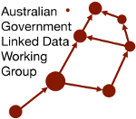

# Vocabularies Publication Profile
This is a *profile* of the [Simple Knowledge Organization System (SKOS)](https://www.w3.org/TR/skos-reference/) that constrains SKOS use with simple rules such as once Concept Scheme per vocabulary and per file and ensure basic catalogue metadata is present.

It is intended for managing sets of basic categorisation vocabularies in catalogues.

## What is a _profile_?

By *profile*, what is meant here is:

> "A specification that constrains, extends, combines, or provides guidance or explanation about the usage of other specifications" 
> 
-- [The Profiles Vocabulary](https://www.w3.org/TR/dx-prof/)

In this case, the *other specification* are SKOS and [schema.org](https://schema.org) and, in legacy mode, [DCMI Metadata Terms (DCTERMS)](https://www.dublincore.org/specifications/dublin-core/dcmi-terms/)

This profile is formulated according to [The Profiles Vocabulary](https://www.w3.org/TR/dx-prof/) and provides [Shapes Constraint Language (SHACL)](https://www.w3.org/TR/shacl/) validator files that can be used to determine whether vocabularies conform to this profile.

This profile is hosted online in [Linked Data](https://www.w3.org/standards/semanticweb/data) form using a persistent web address:

* <https://linked.data.gov.au/def/vocpub>


## Profile Definition & Specification

For an overview of all the elements of this Profile, see the Profile Definition:

* <https://linked.data.gov.au/def/vocpub>

For all the Profile's rules, see the Specification:

* <https://linked.data.gov.au/def/vocpub/spec>

For the technical SHACL validator, see:

* <https://linked.data.gov.au/def/vocpub/validator>


## License  
This code is licensed using the [CC BY 4.0](https://creativecommons.org/licenses/by/4.0/) licence. See the [LICENSE file](LICENSE) for the deed. 

Note [Citation](#citation) below for attribution.


## Citation
To cite this profile, please use the following (formulated in [BibTex](http://www.bibtex.org/)):

```
@software{vocpub-profile,
  author = {{Nicholas J. Car}},
  title = {{Vocabulary Publication Profile}},
  version = {5.4},
  date = {2026},
  publisher = {{Australian Government Linked Data Working Group}},
  url = {https://linked.data.gov.au/def/vocpub}
}
``` 


## Contact
*publisher:*  
  
**Australian Government Linked Data Working Group**  
<https://www.linked.data.gov.au>  

*creator:*  
**Dr Nicholas J. Car**  
*Honorary Lecturer*  
Australian National University    
<nicholas.car@anu.edu.au>  
<https://orcid.org/0000-0002-8742-7730>  
<https://cecs.anu.edu.au/people/nicholas-car>